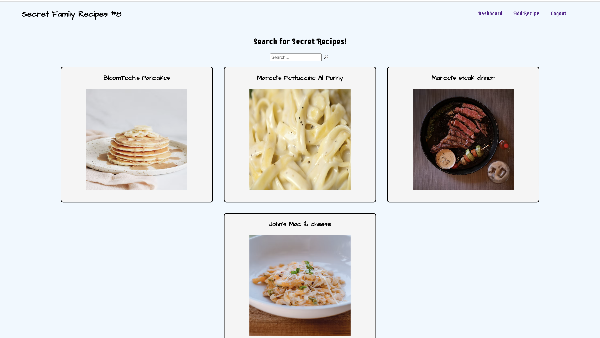

We have been using Live-Share, so many of our changes were made in a single branch - all team members contributed to shared branches!

# Secret Family Recipes Cookbook

placeholder

## Table of contents

- [Overview](#overview)
  - [The App](#the-app)
  - [Screenshot](#screenshot)
  - [Links](#links)
- [Authors](#authors)
- [Fast Instructions for running this project](#fast-instructions-for-running-this-project)
- [General Instructions for React Apps](#general-instructions-for-react-apps)
  - [`npm start`](#npm-start)
  - [`npm test`](#npm-test)
  - [`npm run build`](#npm-run-build)
  - [`npm run eject`](#npm-run-eject)
- [The process](#the-process)
  - [Built with](#built-with)
  - [Continued development](#continued-development)

## Overview

Keeping track of all your passed down family recipes is a pain, our Recipes Cookbook fixes this.

### The App

- Users can register an account and login

- Users can view recipes, click on them to see more details, edit and delete them, and also create new recipes.

### Screenshot

### Links

- Assignment: https://www.notion.so/Secret-Family-Recipes-Cookbook-ecf9be06b6044e9cb5e69eba6f82f658

- Live Site URL: placeholder

- Login Endpoint: https://secret-family-recipes-8.herokuapp.com/api/auth/login

## Authors

- John Merz
- Marcel Rodriguez
- Austin Marrazza
- Nelson Maldonado 
- Andrew Hunt

## Fast Instructions for running this project

- You need React on your local environment.
- clone project
- in terminal `npm install`
- then `npm start`
- find all necesssary imports at the top of each file. Be sure you load...
  - npm i axios
  - npm i react-router-dom

## General Instructions for React Apps

In the project directory, you can run:

### `npm start`

Runs the app in the development mode.\
Open [http://localhost:3000](http://localhost:3000) to view it in the browser.

The page will reload if you make edits.\
You will also see any lint errors in the console.

### `npm test`

Launches the test runner in the interactive watch mode.\
See the section about [running tests](https://facebook.github.io/create-react-app/docs/running-tests) for more information.

### `npm run build`

Builds the app for production to the `build` folder.\
It correctly bundles React in production mode and optimizes the build for the best performance.

The build is minified and the filenames include the hashes.\
Your app is ready to be deployed!

See the section about [deployment](https://facebook.github.io/create-react-app/docs/deployment) for more information.

### `npm run eject`

**Note: this is a one-way operation. Once you `eject`, you can’t go back!**

If you aren’t satisfied with the build tool and configuration choices, you can `eject` at any time. This command will remove the single build dependency from your project.

Instead, it will copy all the configuration files and the transitive dependencies (webpack, Babel, ESLint, etc) right into your project so you have full control over them. All of the commands except `eject` will still work, but they will point to the copied scripts so you can tweak them. At this point you’re on your own.

You don’t have to ever use `eject`. The curated feature set is suitable for small and middle deployments, and you shouldn’t feel obligated to use this feature. However we understand that this tool wouldn’t be useful if you couldn’t customize it when you are ready for it.

## The process

- Built flow chart with Figma to visualize dashboard and components
- Assigned tasks to team members depending on strengths and knowledge
- Held daily meetings to pair program and regroup
- Created basic functionality, then added style and launched
- Connected front end to back end

### Built with

- Semantic HTML5 markup
- CSS
- Flexbox
- [React](https://reactjs.org/) - JS library

### Continued development

- Invite others to view your cookbook
- Sync recipes across an entire family
- Allow users to buy ingredients directly through the website